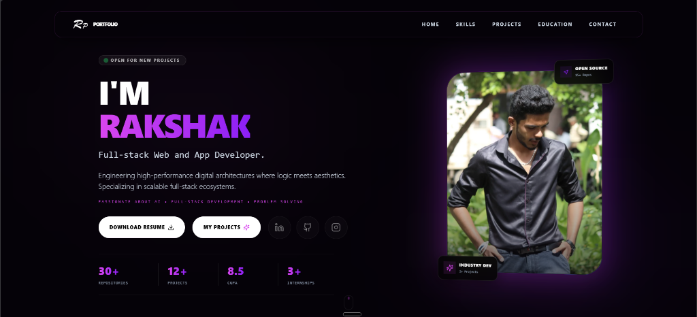

# MY Portfolio • Full-Stack Developer Platform



This is my developer portfolio, featuring selected work showcases, dynamic client listings, interactive live preview sandboxes, and a full-featured admin console to manage projects, skills, and resume data on the fly. 

It's designed with glassmorphism aesthetics, neon accent glows, and smooth responsive grids.

🔗 **Live Links:**
- **Portfolio Homepage**: [rp-portfolio-olbv.vercel.app](https://rp-portfolio-olbv.vercel.app/)
- **Projects Showcase Page**: [rp-portfolio-olbv.vercel.app/projects](https://rp-portfolio-olbv.vercel.app/projects)

---

## ⚡ Quick Start

### 1. Clone the project & install packages
```bash
git clone <your-repo-url>
cd RP_PORTFOLIO
npm install
```

### 2. Configure Environment Variables (`.env`)
Create a `.env` file in the root directory:
```env
PORT=5000
MONGODB_URI=mongodb://localhost:27017/portfolio
JWT_SECRET=your_super_secret_jwt_key
API_URL=http://localhost:5000
```

### 3. Seed Database
Seed initial homepage info, sample works, and skills data:
```bash
node server/scripts/seed.js
```

### 4. Run Locally (Concurrent Mode)
Spin up both the React frontend (Vite) and the Express API server simultaneously:
```bash
npm run dev:all
```
- **Frontend App**: [http://localhost:8080](http://localhost:8080) (or whichever port Vite claims)
- **Backend API**: [http://localhost:5000](http://localhost:5000)

---

## 🛠️ Tech Stack

- **Frontend**: React (Vite), TypeScript, Tailwind CSS, Lucide icons, Radix UI (Shadcn primitives).
- **Backend**: Node.js, Express, Multer (image uploads), JWT authentication.
- **Database**: MongoDB (via Mongoose ODM).
- **Tooling**: Concurrently (multi-process developer running), ESLint.

---

## 📁 Repository Layout

```
├── public/                  # Static assets & icons
├── server/
│   ├── middleware/          # JWT Auth guards & request parsers
│   ├── models/              # MongoDB Mongoose schemas (Project, Skill, User, Hero, Company)
│   ├── routes/              # Express API endpoints (/api/auth, /api/projects, etc.)
│   ├── scripts/             # DB seeding scripts (seed.js)
│   ├── uploads/             # Server-side uploaded assets
│   └── server.js            # Express server entry point
├── src/
│   ├── assets/              # Inline images, logo, and JPEG headers
│   ├── components/          # Reusable modules (Hero, Skills, Projects, Footer, etc.)
│   ├── hooks/               # Custom react hooks
│   ├── lib/                 # Core caching layers & utilities
│   ├── pages/               # Main layout routes (Index page, Admin Login, Admin Dashboard)
│   ├── App.tsx              # React router routing tree
│   └── main.tsx             # DOM injection entry
└── tailwind.config.ts       # Themes, animations, and custom colors setup
```

---

## 🚀 Key Features

### 💻 Dynamic Showcase Grid
The main page highlights a clean selection of works. Clicking **Archive of all works** or **My Projects** routes visitors to `/projects`:
- **Zero-Clipping Sandbox**: Live iframe views scale responsively to matching card containers dynamically on resize.
- **Interactive Search & Category Filters**: Dynamic counts update on category clicks, and visitors can filter tags instantly.

### 🛡️ Fully Protected Admin Console
Navigate to `/admin/login` to manage your portfolio:
- Add, update, hide, or delete skills and companies.
- Upload project screenshots directly using standard drag-drop interfaces (handled by Multer server uploads).
- Hide drafts or outdated creations from the front-end showcase using quick toggles.
